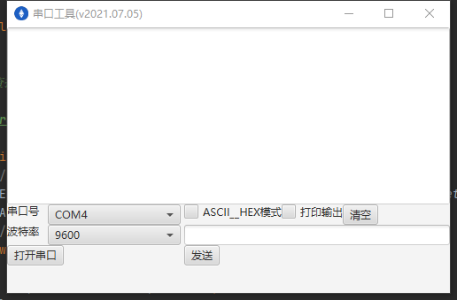

## java 串口工具  
依赖RXTXcomm.jar库   
环境依赖 http://fizzed.com/oss/rxtx-for-java  
内含32位与64位版本    
使用方法：   
拷贝 RXTXcomm.jar 到 JAVA_HOME\jre\lib\ext目录中；   
拷贝 rxtxSerial.dll 到 JAVA_HOME\jre\bin目录中；   
拷贝rxtxParallel.dll 到 JAVA_HOME\jre\bin目录中；   
JAVA_HOME为jdk安装路径  


数据上传地址配置

```config.properties
server=127.0.0.1:3001
```

